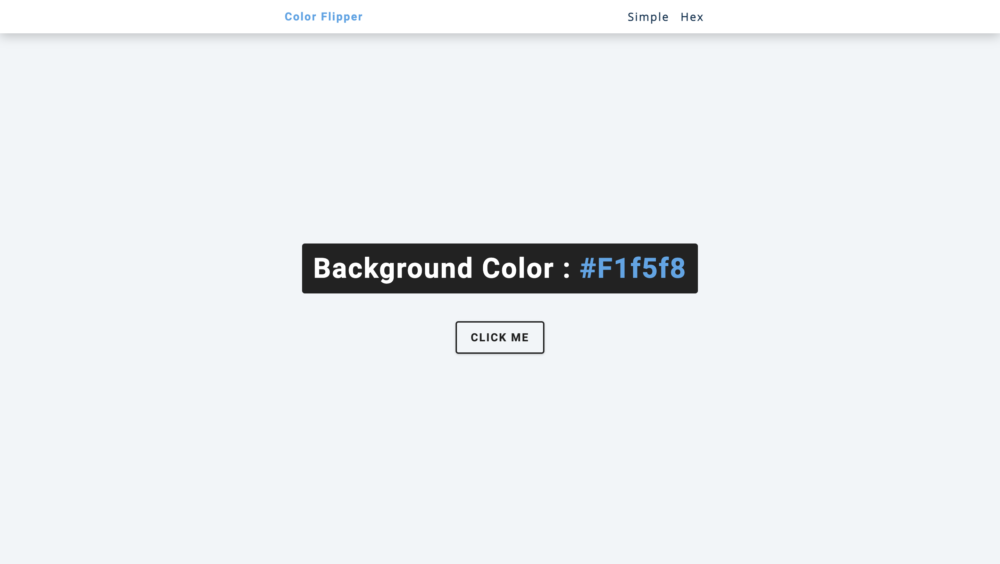

## Color Flipper

This project is a simple color flipper built using HTML, CSS, and JavaScript. It demonstrates the use of vanilla JavaScript to manipulate the DOM and dynamically change the background color of a web page.

### Challenges Addressed

-   **Generating random colors:**  The project implements logic to generate random hexadecimal color codes for the background.
-   **DOM manipulation:**  JavaScript code interacts with the DOM to change the background color style property of the body element.

### Technologies Used

-   HTML: Provides the basic structure of the web page.
-   CSS: Styles the layout and appearance of the page.
-   JavaScript: Adds interactivity and manipulates the DOM to change the background color.
